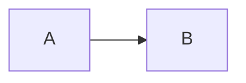
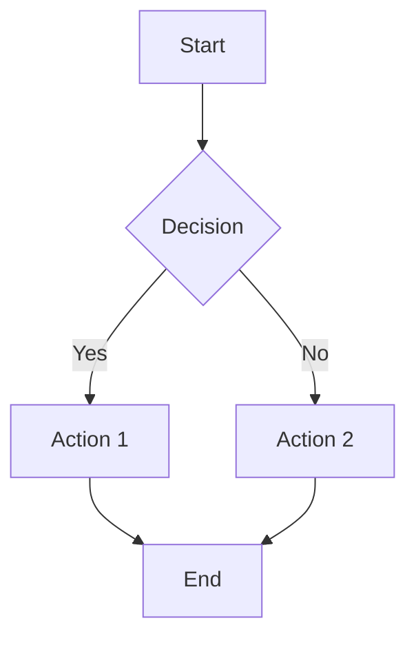
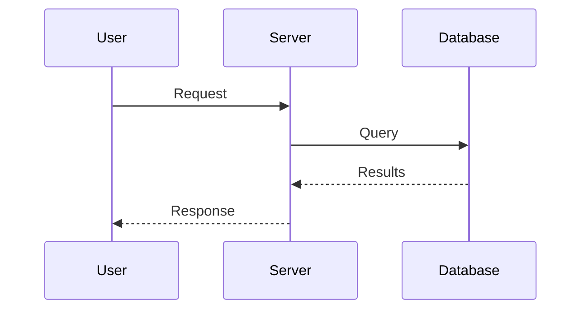
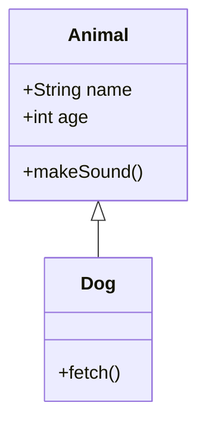
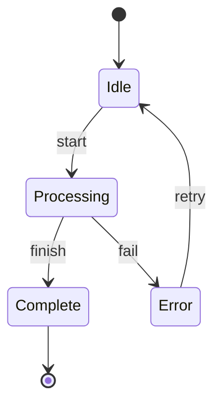
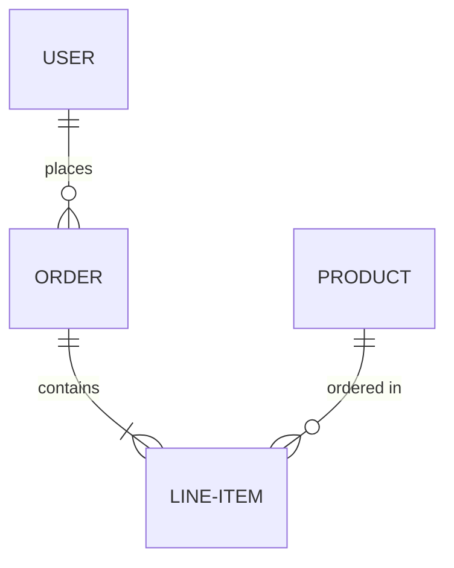
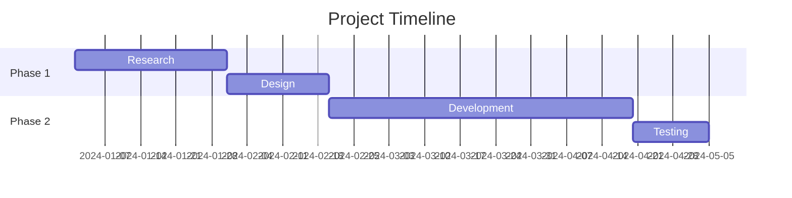
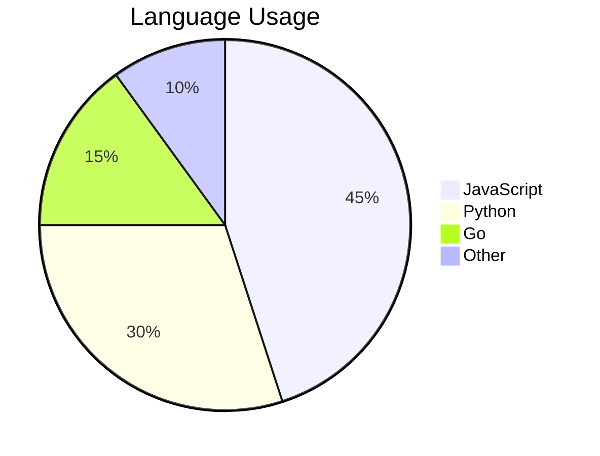
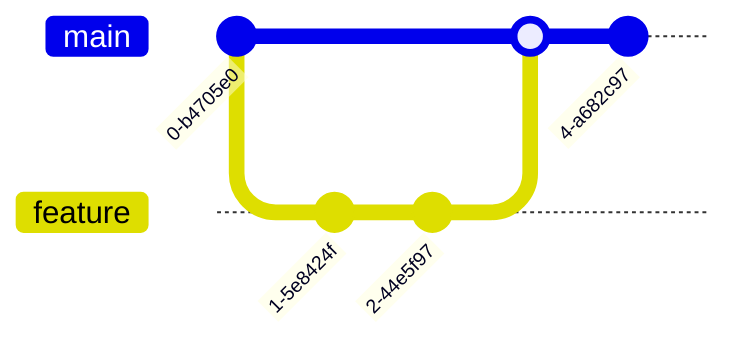

# add-diagram Skill

**Description:**
Add Mermaid diagrams to an existing Slidev presentation to visualize concepts, flows, and relationships.

## Steps
1. Open or locate the `slides.md` file in your Slidev project.
2. Choose the slide where you want to insert the diagram (specify position: beginning, end, or after a specific slide/heading).
3. Insert the Mermaid diagram using a fenced code block with `mermaid` as the language.
4. Save the file and preview changes with `pnpm dev` or your Slidev dev server.

## Diagram Syntax
Wrap your diagram in:
````markdown

````

## Diagram Types
- **Flowchart**: `graph TD` or `graph LR`
- **Sequence Diagram**: `sequenceDiagram`
- **Others**: See [Mermaid docs](https://mermaid-js.github.io/mermaid/#/)

## Customization Options
- **Presentation Selection:** Specify the target Slidev presentation by providing the path to its `slides.md` file.
- **Insertion Point:** Choose where to insert the diagram (beginning, end, or after a specific slide/heading).
- **Diagram Type:** Select from flowchart, sequence, or other supported Mermaid diagrams.

## Rules
- **Never replace existing diagrams or content** unless the user explicitly requests a replacement.
- **Insertion only:** All diagram additions must preserve current content and order, except for the specified insertion point.
- **Explicit replacement:** If the user requests to replace a diagram, confirm the target and proceed only with clear user intent.

## Example Usage
- *Insert a flowchart diagram after the "Introduction" slide in `presentations/openspec-with-copliot-experience/slides.md`.*
- *Add a sequence diagram at the end of `presentations/transport-slides/slides.md`.*

## Tips
- Use `/slidevjs/slidev` or Mermaid docs for more diagram options.
- Save and preview to verify your changes.

## Limitations
- Mermaid diagrams must be in a fenced code block with `mermaid` as the language.
- Some complex diagrams may require additional Mermaid configuration or may not render identically in all themes.

## Diagram Examples

### Flowchart


### Sequence Diagram


### Class Diagram


### State Diagram


### Entity Relationship


### Gantt Chart


### Pie Chart


### Git Graph

