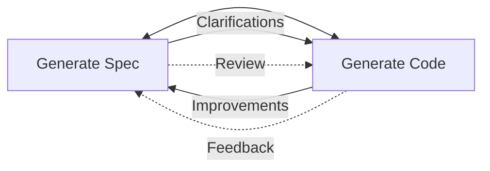
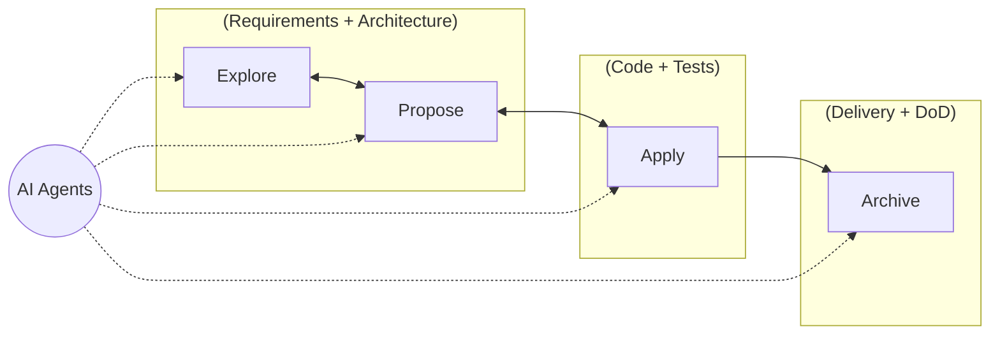
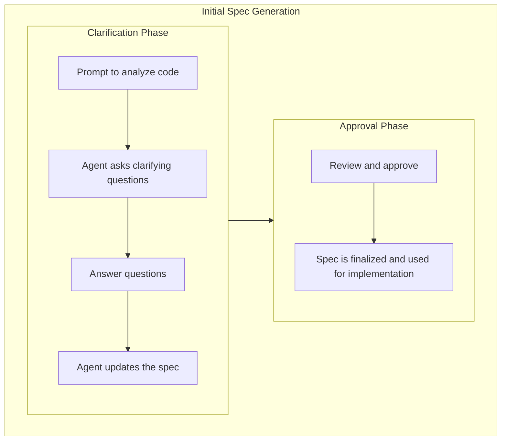

---

# Spec Driven Development with OpenSpec & Copilot

> A practical guide to using Spec-driven Development (SDD) and AI agents for safe, traceable, and efficient evolution of complex codebases.

_by Sathishkumar Deena Kirupakaran | Apr 2026_

---


# What is Spec-driven Development? (SDD)



- Ensures code and requirements stay in sync for fewer bugs.
- Makes changes traceable and collaboration easier.
- Enables AI agents to assist with clear guidance and feedback loops.

---


# OpenSpec: What & Where

OpenSpec is an open-source, spec-driven AI management tool for AI coding assistants. It helps you align on requirements, organize changes, and automate workflows for both greenfield and brownfield projects.

**GitHub Repository:**  
https://github.com/Fission-AI/OpenSpec

**Quick Start:**

- Requires Node.js 20.19.0 or higher.
- Install OpenSpec globally:
  ```sh
  npm install -g @fission-ai/openspec@latest
  ```
- Navigate to your project directory and initialize:
  ```sh
  cd your-project
  openspec init
  ```
  
> Also works with pnpm, yarn, bun, and nix. See the repo for more installation options and advanced workflows.

---

# OpenSpec: Non-Interactive Setup for Copilot & Windsurf

For CI/CD or scripted environments, you can configure OpenSpec to set up GitHub Copilot and Windsurf support non-interactively:

**Configure both tools at once:**
```sh
openspec init --tools github-copilot,windsurf
```

**Configure all supported tools:**
```sh
openspec init --tools all
```

> This ensures that OpenSpec generates the necessary skills and command files for GitHub Copilot and Windsurf, enabling seamless integration in both local and automated setups.

See the [Supported Tools documentation](https://github.com/Fission-AI/OpenSpec/blob/main/docs/supported-tools.md) for more details.

---

# Openspec: Spec-based AI Management Tool

> **Note:** OpenSpec Spec-driven development (SDD) empowers AI coding assistants to accelerate every phase—exploring, proposing, applying, and archiving changes—by providing clear, modular specs and traceable workflows.
 


- Actions, not phases — create, implement, update, archive — do any of them anytime
- Dependencies are enablers — they show what's possible, not what's required next

---

# OpenSpec Prompts (.github folder)

Prompts = instructions for a single action

| Prompt                | Description                                                      |
|-----------------------------|------------------------------------------------------------------|
| opsx-propose.prompt.md      | Propose a new change and generate all planning artifacts at once. |
| opsx-apply.prompt.md        | Implement tasks from an OpenSpec change, tracking progress.       |
| opsx-explore.prompt.md      | Enter explore mode to think through ideas and clarify problems.   |
| opsx-archive.prompt.md      | Archive a completed change after verifying all tasks are done.    |

Each prompt guides Copilot or your agent through a key phase of the OpenSpec workflow, ensuring clarity and traceability.

---


# OpenSpec Skills (.github folder)

Skills = packaged workflows or capabilities, often using prompts and additional logic

| Skill                    | Description                                                                 |
|--------------------------|-----------------------------------------------------------------------------|
| openspec-propose         | Propose a new change and generate all required artifacts in one step.        |
| openspec-explore         | Enter explore mode to investigate, clarify, and visualize ideas or problems. |
| openspec-apply-change    | Implement tasks from an OpenSpec change, tracking progress and completion.   |
| openspec-archive-change  | Archive a completed change after verifying all tasks and artifacts are done. |

Each skill enables Copilot or your agent to automate and structure key OpenSpec actions for better traceability and collaboration.

---

# Usecase: Firebolt C++ Transport

https://github.com/rdkcentral/firebolt-cpp-transport

Why this repo?
- Brownfield codebase with unique challenges that require careful change management and traceability.
- More than 90% of our org have Brownfield codebases.
- New functionality handed off from another org lacking requirements and documentation.

What is the objective?
- Explore and create specs for existing code.
- Analyze missing functionality.
- Propose and implement changes.
- Document and share learnings.

> Use VS Code with Copilot and preferably a simple Agent like GPT-4.1(0x Tokens) from spec generation to code implementation and documentation.

---

# [Explore] Interactive Spec Generation

```sh
$ /ospx-explore "Explore current repository and generate specs for transport layer. Prompt questions 
when you need more info" --output "specs/"
```



---

# [Explore]: AI Generated Specs

```sh
$ ls
specs/
├── cpp_specifics_spec.md
├── header_interfaces_spec.md
├── json_rpc_handling_spec.md
├── transport_layer_spec.md
├── transport_recommendations_spec.md
changes/
├── archive/
```

- Challenge: Specs were monolithic and hard to update
- Approach: Broke down specs into modular components
- Result: Easier to review, update, and track changes

---

# [Explore] AI Generated Recommendations

- Support headers in the transport layer
- Add robust support for JSON-RPC batch requests
- Make retry logic optional and client-driven
- Ensure full JSON-RPC compliance (batch, error reporting)
- Provide async batch handling and granular error reporting
- Document thread safety, callback registration, and error handling

---

# [Propose] New feature: Add Header Support

```sh
$ /ospx-propose "Add header support to transport layer" --spec "header_support_spec.md" --tasks "tasks.md"
...
Refine Proposal
...
$ ls # After proposal finalization
└── add-header-support/
    ├── add_header_support_proposal.md   # Captures the requirement and why this change is needed
    ├── design.md                       # Explains how the change can be implemented
    ├── specs/
    │   └── header_support_spec.md       # Details the expected behavior and API for the change
    └── tasks.md                        # Lists the concrete steps needed to complete the change
```
---

# [Apply] Implementing Tasks with Copilot

```sh
$ /ospx-apply "add-header-support"
```

- [x] Update `Config` struct to include `headers` field
- [x] Update `connect` method to accept and use headers
- [x] Implement header injection in transport layer
- [x] Implement response header retrieval in transport layer
- [x] Expose `getResponseHeader` in `IGateway` interface
- [x] Ensure thread safety and error handling for header operations
- [x] Add unit and integration tests for header injection and retrieval
- [x] Update documentation for new header support
- [ ] Review and archive the change in OpenSpec

---

# [Archive] Documenting and Sharing Learnings

```sh
$ /ospx-archive "add-header-support"
```
Update tasks.md
- [x] Review and archive the change in OpenSpec

- Captures the rationale, design decisions, implementation details, and results of the change.
- Serves as a reference for future changes and promotes knowledge sharing across the team.

---

# Key Takeaways

Openspec Branch
https://github.com/rdkcentral/firebolt-cpp-transport/tree/feature/openspec

- AI accelerates structured change management
- OpenSpec ensures traceability and review
- AI agents improve productivity and documentation
- AI + Openspec also powers Slidev for presentations(Thanks to #comcast-ai-community
)
  - Current slides are Auto Generated from OpenSpec and Copilot chat conversations.
  - Multiple Reusable Skills generated for creating slides based on the effort
   ```sh
    $ /init-slidev-presentation "openspec-with-copliot-experience" --content "slides.md"
    $ /add-slide "openspec-with-copliot-experience" --content "slides.md" --slideTitle "Slide Title"
    $ /add-diagram "openspec-with-copliot-experience" --content "slides.md" --diagramCode "mermaid code here"
    $ /export-slidev-presentation "openspec-with-copliot-experience" --format pdf
  ```

---

# Next Steps

- Share learning with team.
- RDK-E Middleware Crews will expand usage of OpenSpec.
- Continue integrating SDD into other repositories and workflows


# Q&A
- Questions and discussion

Thank you

---
